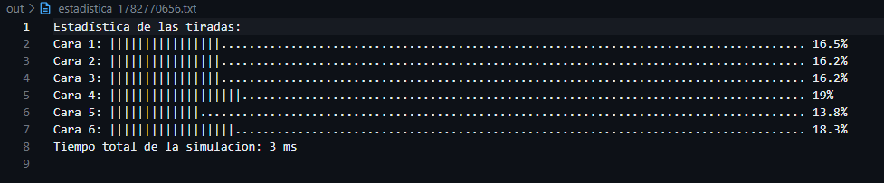
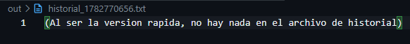
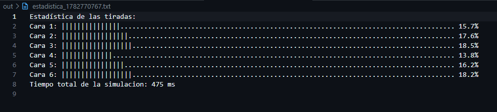
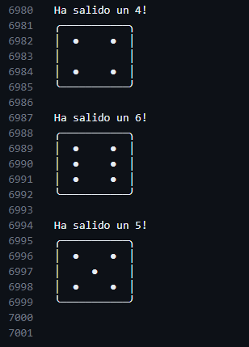

# 🎲 DadoSim — Simulador de tirada de dados en C++ 🎲

Simulador de dados por línea de comandos escrito en C++.
Lanza un dado de 6 caras N veces, guarda el historial visual en un archivo y genera automáticamente una estadística con gráfico de barras en otro.

---

## Características

- Lanza un dado de 6 caras el número de veces que elijas
- **Modo normal**: guarda cada tirada con su representación ASCII en `out/historial_*.txt`
- **Modo rápido**: omite el arte ASCII y solo guarda estadísticas, ideal para millones de tiradas
- Genera `out/estadistica_*.txt` con un gráfico de barras y los porcentajes de cada cara
- Mide y muestra el tiempo total de la simulación en milisegundos
- Los archivos de salida llevan marca de tiempo para no sobreescribirse entre ejecuciones (tiempo epoch/Unix)

---

## Ejemplo de salida

**Historial** (`out/historial_*.txt`):
```
Ha salido un 3!
╭───────────╮
│  ●        │
│     ●     │
│        ●  │
╰───────────╯

Ha salido un 1!
╭───────────╮
│           │
│     ●     │
│           │
╰───────────╯
```

**Estadística** (`out/estadistica_*.txt`):
```
Estadística de las tiradas:
Cara 1: |||||||||||.....................................................................  11%
Cara 2: |||||||||||||||.................................................................  15%
Cara 3: |||||||||||||||||...............................................................  17%
Cara 4: |||||||||||||||||||.............................................................  19%
Cara 5: ||||||||||||||||||..............................................................  18%
Cara 6: ||||||||||||||||||||............................................................  20%
Tiempo total de la simulación: 3 ms
```

---

## Requisitos

- Compilador C++17 o superior (g++ recomendado)

## Comandos
```
- make program        # Compila el programa (crea la carpeta "out" si no existe)
- make clean          # Borra todo los archivos dentro de la carpeta "out"
```

---

## Compilar

```bash
make (program)
```

Esto genera el ejecutable `program.exe`.

---

## Uso

```
./program.exe       # Ejecuta el programa
```

El programa te pedirá:
1. El número de tiradas que quieres simular
2. Si quieres usar el modo rápido (`Y`) o el modo normal/lento (`N`)

Los archivos de salida se crean automáticamente en la carpeta `out/`.

---

## Estructura del proyecto

```
Dados/
├── include/
│   ├── dado.hh     # Struct DadoInfo, caras ASCII y declaraciones
│   └── menu.hh     # Menú de inicio por consola
├── src/
│   └── dado.cc     # Implementación: lanzar dado, estadísticas
├── out/            # Archivos generados (historial y estadística)
├── main.cc         # Punto de entrada
└── Makefile
```

---

## Ejemplos de Tiradas
<detail>
    <summary> Versión rápida </summary>
        <p align="center">
            
            
        </p>
</detail>

<detail>
    <summary> Versión lenta </summary>
        <p align="center">
            
            
        </p>
</detail>


## Autor

Martin (@martinmol2007)